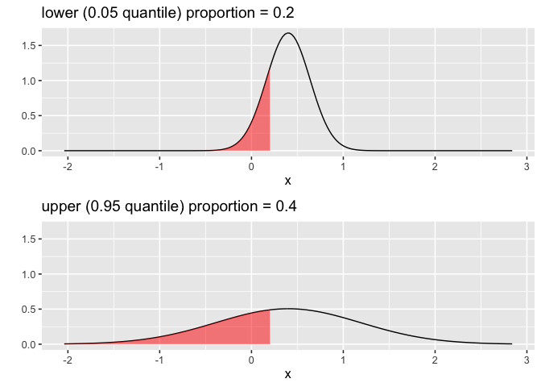
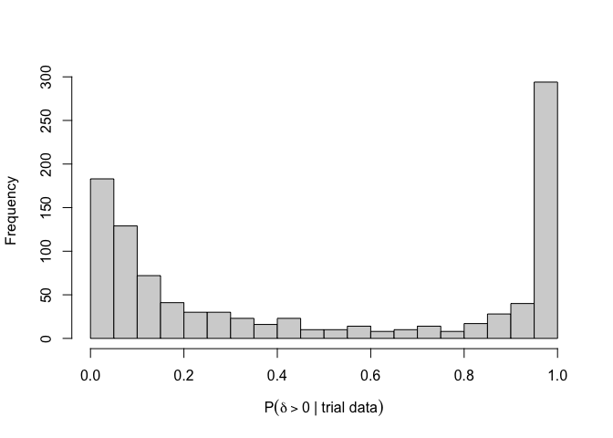

README
================

<!-- README.md is generated from README.Rmd. Please edit that file -->

# assurance

<!-- badges: start -->

<!-- badges: end -->

An R package for implementing the assurance method for normally
distributed data, with elicited distributions for the treatment effect,
and the population variances in the treatment and control arms. The
package implements the methodology from

  - Alhussain, Z. A. and Oakley, J. E. (2019). [Assurance for clinical
    trial design with normally distributed outcomes: eliciting
    uncertainty about variances](https://arxiv.org/abs/1702.00978v2).
    arXiv:1702.00978v2.

## Installation

The `assurance` package is currently on GitHub only, and requires the
development version of `SHELF` (also on GitHub only). Install these with
the commands

``` r
install.packages("devtools")
devtools::install_github("OakleyJ/SHELF")
devtools::install_github("OakleyJ/assurance")
```

## Example

This code illustrates the example from Alhussein and Oakley (2019).

We suppose the expert judges   
 = 0.5,")  
and conditional on , the expert judges   
 = 0.25,
")  
  
 = 0.5, 
")  
  
 = 0.75. 
")  

We fit a distribution to these judgements with the command

``` r
v <- c(0.25, 0.4, 0.55)
p <- c(0.25, 0.5, 0.75)
myfitDelta <- SHELF::fitdist(vals = v, probs = p)
```

We suppose that a response of at least 0.2 is required for a patient to
benefit. We suppose that if treatment effect were , expert judges between 60% and 80% of patients would
benefit.

``` r
myfitTau <- SHELF::fitprecision(c(-Inf, 0.2),
                                propvals = c(0.2, 0.4),
                                propprobs = c(0.05, 0.95),
                                med = 0.4)
```



We now estimate the assurance, for sample sizes of 20 patients per
group:

``` r
assurance::assuranceNormal(fitDelta = myfitDelta,
                fitPrecisionTmt = myfitTau,
                pDeltaZero  = 0.5,
                nTreatment = 20,
                nControl = 20)
#> [1] 0.357
```

Next, we consider the information that might result from observing 10
patients in each arm. Denoting these 20 observations by
, we consider the
predictive distribution of

  
,
")  
as a function of the yet-to-be-observed data
. The following command
will simulate 1000 trials, and estimate the probability of a positive
treatment effect given the data from each trial.

``` r
pEffective <- assurance::sampleInterim(fitDelta = myfitDelta,
                                       fitPrecisionTmt = myfitTau,
                                       nControl = 10,
                                       nTreatment = 10,
                                       pDeltaZero = 0.5,
                                       nTrials = 1000)
```

We would like   
,
")  
to be close to 0 or 1. We count the proportion of the 1000 trials in
which this probability is either less than 0.05, or greater than 0.95:

``` r
mean(pEffective < 0.05 | pEffective > 0.95)
#> [1] 0.476
```

We display the predictive distribution of posterior probabilities with a
histogram:

``` r
hist(pEffective, breaks = seq(from = 0, 
                              to = 1, 
                              by = 0.05),
     xlab = expression(P(delta>0~"| trial data")),
     main ="")
```



## `shiny` app

A `shiny` app is included in the package for implementing all the above
methods. To launch the app, run the command

``` r
assuranceNormalApp()
```
